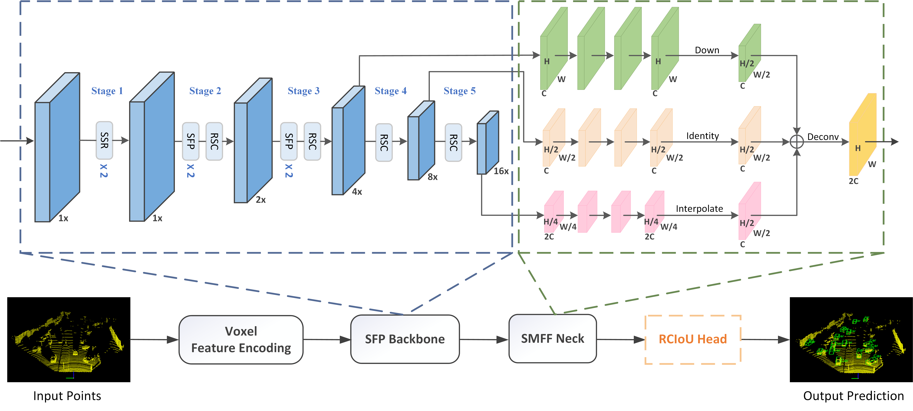

# LMIINet: Long-range and Multi-scale Information Interaction Network for 3D Object Detection

  

## Abstract

LiDAR-based 3D object detection is crucial for perception systems in autonomous driving. However, current methods perform poorly in detecting occluded and small objects due to the sparse and uneven distribution of point clouds in 3D scenes. To address this problem, we propose a Long-range and Multi-scale Information Interaction Network (LMIINet) for 3D object detection. Firstly, a feature extraction backbone with a spatial feature pyramid (SFP) block is designed to effectively capture long-range dependencies between features. Then, multi-scale spatial features from the 3D backbone are adaptively fused at the neck to aggregate local and global contextual information. Finally, by fully utilizing the correlations between bounding box parameters, the proposed RCIoU loss is employed for the classification and regression supervision of bounding boxes to improve the one-stage point cloud detectors. LMIINet achieves competitive performance in the small object (pedestrian and cyclist) classes on the KITTI benchmark. Compared to the benchmark network SECOND, LMIINet increases mAP3D/mAPBEV by 1.98\%/2.09\%, 12.25\%/11.14\%, and 6.44\%/6.45\% for the car, pedestrian, and cyclist classes, respectively.

## Overview

- [Installation](docs/INSTALL.md)
- [Getting Started](docs/GETTING_STARTED.md)
- [License](#license)
- [Acknowledgement](#acknowledgement)

## Installation

Please refer to [INSTALL.md](docs/INSTALL.md) for the installation of `LMIINet`.

## Getting Started

Please refer to [GETTING_STARTED.md](docs/GETTING_STARTED.md) to learn more usage about this project.

## License

`LMIINet` is released under the [Apache 2.0 license](LICENSE).

## Acknowledgement

We would like to thank the authors of [`OpenPCDet`](https://github.com/open-mmlab/OpenPCDet) for their open source release of their codebase.

